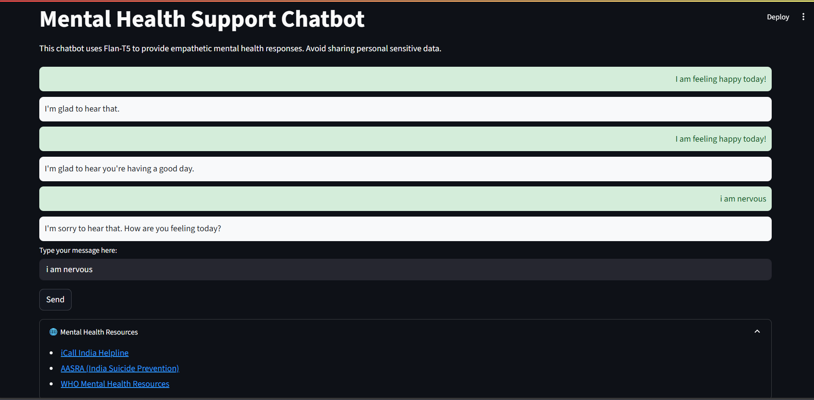

#  Mental Health Support Chatbot

This project is an empathetic mental health support chatbot built using **Flan-T5 Large** with **Streamlit**. It provides supportive responses to user inputs and displays them in a clean chat UI.

##  Features

✅ Uses **Flan-T5 Large** (instruction-tuned model) for meaningful, empathetic replies  
✅ Built with **Streamlit** for interactive UI  
✅ Styled chat bubbles for user and bot messages  
✅ Includes mental health resources for real-world support


##  Screenshot



##  Installation

1. **Clone the repository**

```bash
git clone https://github.com/anirudhcherukuri/mental-health-chatbot.git
cd mental-health-chatbot
